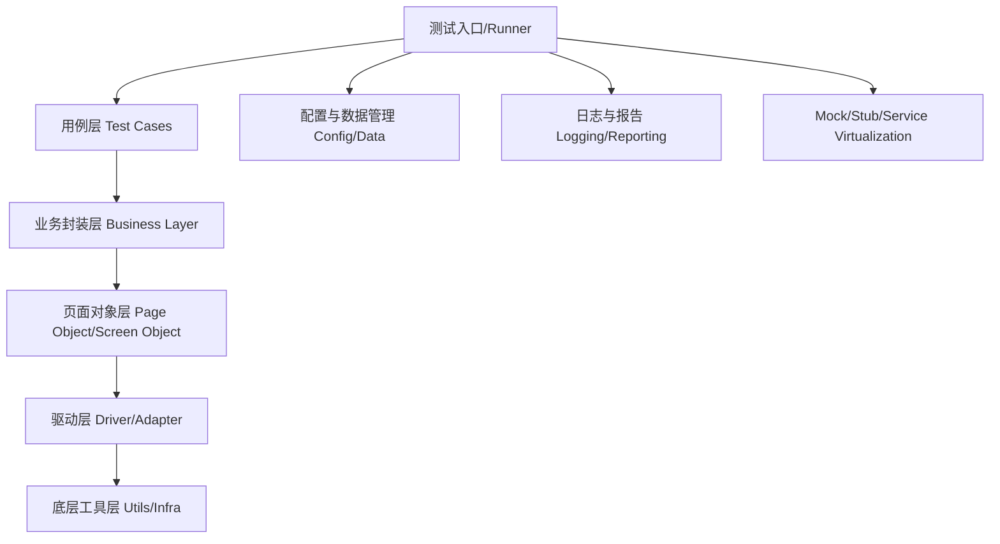

# 自动化测试框架系统设计

## 1. 设计目标

- **健壮性**：能应对异常、失败、环境变化，易于排查和恢复。
- **可扩展性**：支持新功能、新平台、新类型测试的平滑扩展。
- **可维护性**：结构清晰，易于理解和修改。
- **可复用性**：通用组件、工具和用例可被多项目/多团队复用。
- **易用性**：接口友好，文档完善，易于上手。

---

## 2. 分层架构设计



### 各层说明

1. **测试入口/Runner**  
   统一调度测试执行，支持命令行、CI/CD集成、参数化执行等。
2. **用例层（Test Cases）**  
   只描述业务流程和断言，避免底层细节，支持数据驱动、参数化。
3. **业务封装层（Business Layer）**  
   封装常用业务操作（如登录、下单），便于复用和维护。
4. **页面对象层（Page Object/Screen Object）**  
   封装页面/界面元素及操作，隔离UI变更影响。
5. **驱动层（Driver/Adapter）**  
   封装Selenium/Appium/Playwright等底层驱动，支持多平台切换。
6. **底层工具层（Utils/Infra）**  
   公共工具、日志、配置、数据生成、网络拦截、Mock等。
7. **配置与数据管理**  
   环境配置、账号、测试数据、用例参数等集中管理。
8. **日志与报告**  
   统一日志、错误追踪、测试报告生成（如Allure、JUnit XML等）。
9. **Mock/Stub/Service Virtualization**  
   支持外部依赖的虚拟化，提升测试稳定性。

---

## 3. 健壮性设计要点

- **异常捕获与恢复**：全局异常处理，失败截图、日志、自动重试。
- **智能等待与重试机制**：封装等待逻辑，避免硬编码sleep。
- **数据隔离与清理**：用例前后自动准备和清理数据，避免污染。
- **环境自检**：测试前检查依赖服务、网络、配置等，提前发现问题。
- **可插拔Mock/Stub**：支持切换真实/虚拟依赖，提升稳定性。

---

## 4. 可扩展性设计要点

- **插件/中间件机制**：如自定义断言、报告、通知、数据生成等。
- **多平台/多浏览器支持**：驱动层适配不同平台，便于扩展。
- **用例参数化与数据驱动**：支持多数据集、配置组合自动生成用例。
- **模块化目录结构**：每层单独目录，便于团队协作和扩展。

---

## 5. 典型目录结构示例

```
tests/
  ├── cases/           # 用例层
  ├── business/        # 业务封装层
  ├── pages/           # 页面对象层
  ├── drivers/         # 驱动层
  ├── utils/           # 工具/基础设施
  ├── config/          # 配置与数据
  ├── logs/            # 日志
  ├── reports/         # 测试报告
  └── mocks/           # Mock/Stub
```

---

## 6. System Design 关键点

- **高内聚低耦合**：各层职责单一，接口清晰，便于独立演进。
- **可观测性**：日志、监控、告警、报告，便于问题定位和追踪。
- **可插拔/可配置**：如驱动、Mock、报告、通知等可灵活切换。
- **自动化与CI/CD集成**：支持命令行、API、CI流水线自动触发。
- **安全与权限**：敏感数据加密、访问控制、日志脱敏等。

---

## 7. 进阶建议

- 支持分布式/并发执行，提升大规模回归效率。
- 支持多语言/多端测试（Web+App+API）。
- 提供二次开发接口和文档，便于团队扩展。
- 持续集成与持续交付（CI/CD）深度集成。

---

## 8. 总结

一个优秀的自动化测试框架，既要有良好的分层解耦和健壮性，也要具备可扩展、可维护、可复用和易用的系统设计特性。建议结合团队实际需求，逐步演进和优化。 